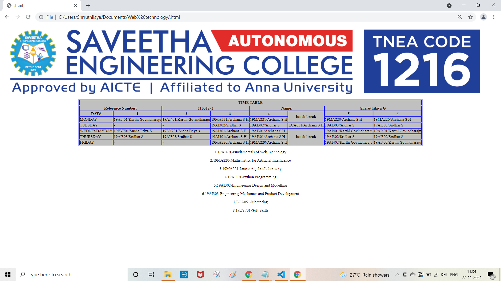

# Experiment_Time_Table

## AIM
To Write a html webpage page to display your timetable.

# ALGORITHM
### STEP 1
create a simple table using table tag
### STEP 2
Add header row using th tag
### STEP 3
Add your timetable
### STEP 4
Execute the program

# CODE
~~~<!DOCTYPE html>
<html lang="en">
   
      <table border = "2" cellspacing="2" bordercolor="blue" bgcolor="silver" align="center">
         <tr>
            <th colspan="8">TIME TABLE</th>
         </tr>

<th colspan=2>Reference Number:</th>
<th colspan=2>21002893</th>
<th colspan=2>Name:</th>
<th colspan=2>Shrruthilaya G</th>
</tr>
         
         <tr>
            <th>DAYS</th>
            <th>1</th>
            <th>2</th>
            <th>3</th>
             <th>4</th>
            <th rowspan="2">lunch break</th>
            <th>5</th>
            <th>6</th>
         </tr>
          <tr>
             <td>MONDAY</td>
             <td>19AI401/Karthi Govindharaju</td>
             <td>19AI401/Karthi Govindharaju</td>
             <td>19MA221/Archana S H</td>
             <td>19MA221/Archana S H</td>
             <td>19MA220/Archana S H</td>
             <td>19MA220/Archana S H</td>
         </tr>
           <tr>
             <td>TUESDAY</td>
             <td>-</td>
             <td>-</td>
             <td>19AI302/Sridhar S</td>
             <td>19AI302/Sridhar S</td>
             <td>ECA051/Archana S H</td>
             <td>19AI303/Sridhar S</td>
             <td>19AI303/Sridhar S</td>
         </tr>
          <tr>
             <td>WEDNESDAYDAY</td>
             <td>19EY701/Sneha Priya S</td>
             <td>19EY701/Sneha Priya s</td>
             <td>19AI301/Archana S H</td>
             <td>19AI301/Archana S H</td>
             <th rowspan="3">lunch break</th>
             <td>19AI401/Karthi Govindharaju</td>
             <td>19AI401/Karthi Govindharaju</td>
         </tr>
          <tr>
             <td>THURSDAY</td>
             <td>19AI303/Sridhar S</td>
             <td>19AI303/Sridhar S</td>
             <td>19AI301/Archana S H</td>
             <td>19AI301/Archana S H</td>
             <td>19AI302/Sridhar S</td>
             <td>19AI302/Sridhar S</td>
         </tr>
          <tr>
             <td>FRIDAY</td>
             <td>-</td>
             <td>-</td>
             <td>19MA220/Archana S H</td>
             <td>19MA220/Archana S H</td>
             <td>19AI402/Karthi Govindharaju</td>
             <td>19AI402/Karthi Govindharaju</td>
         </tr>
  
         
 </table>
      

1.19AI401-Fundamentals of Web Technology

2.19MA220-Mathematics for Artificial Intelligence

3.19MA221-Linear Algebra Laboratory

4.19AI301-Python Programming

5.19AI302-Engineering Design and Modelling

6.19AI303-Engineering Mechanics and Product Development

7.ECA051-Mentoring

8.19EY701-Soft Skills

  </body
  </html>
~~~
# OUPUT

